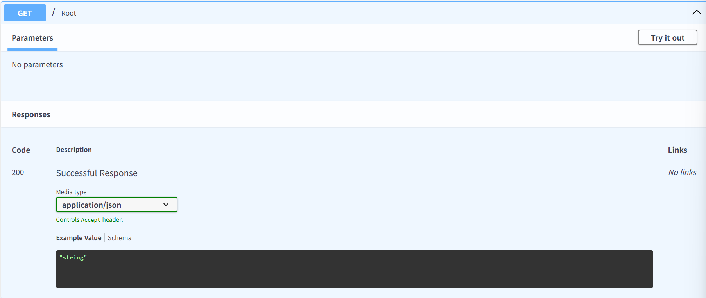
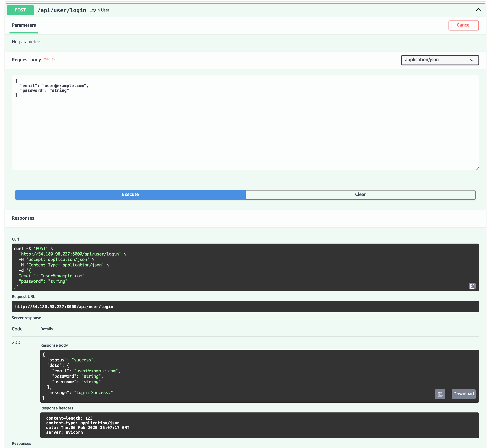
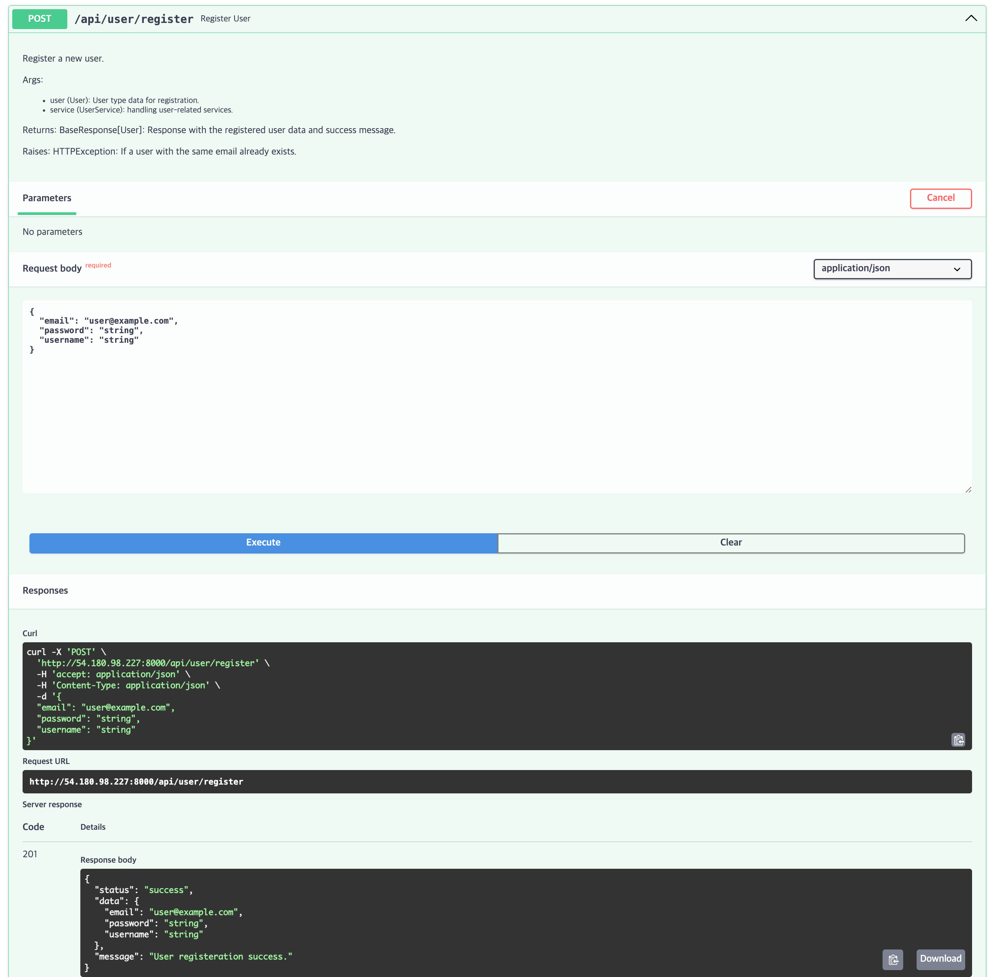
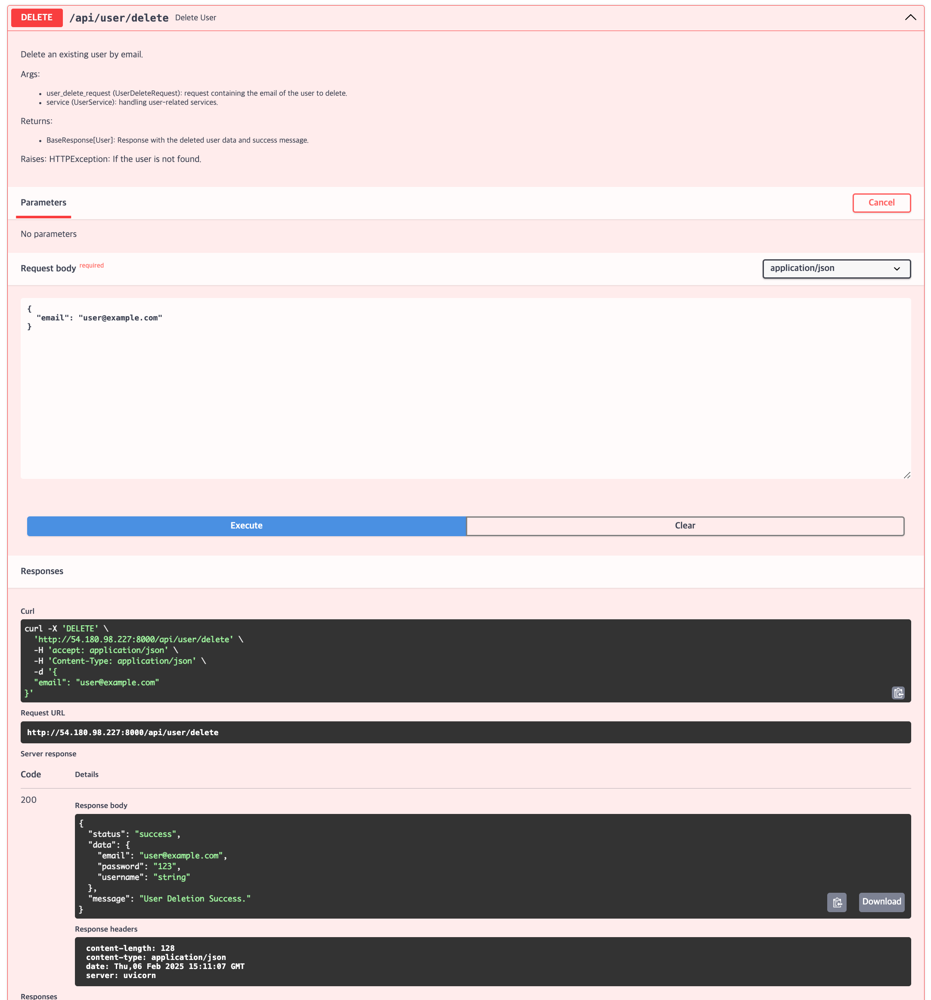
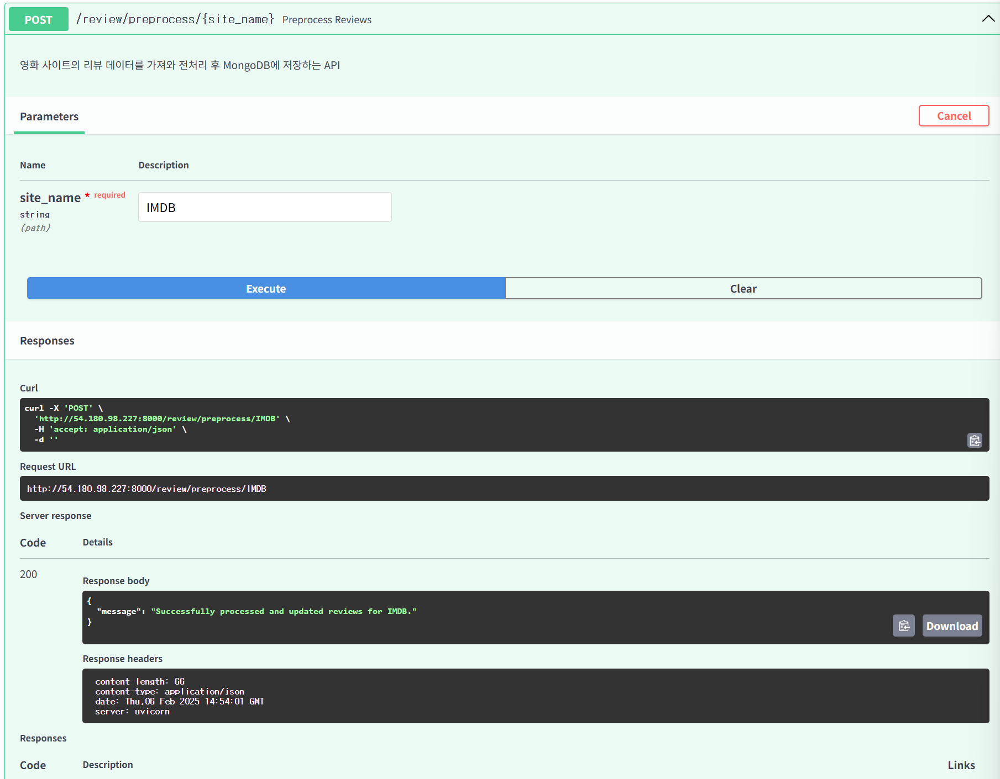
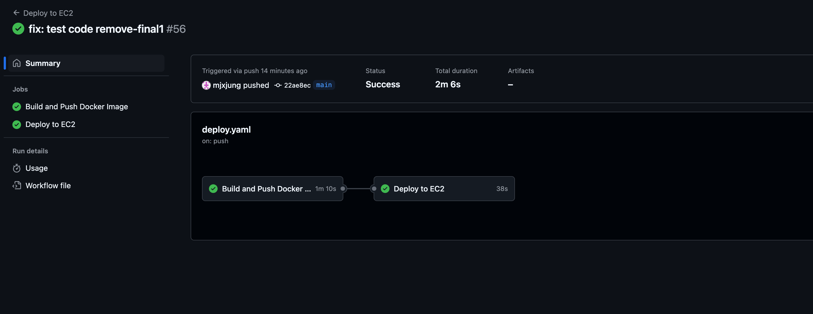
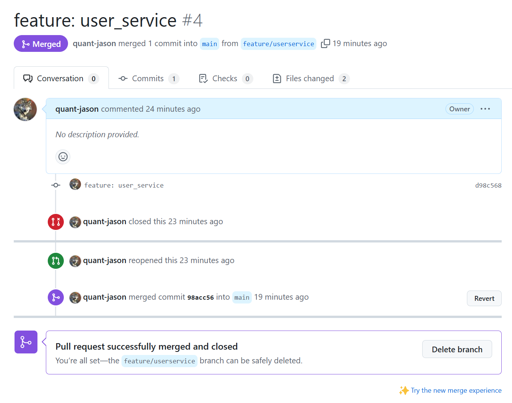
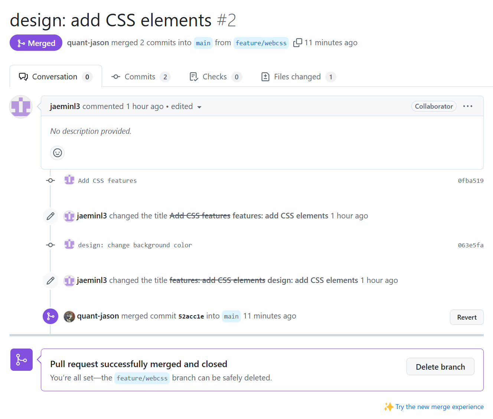
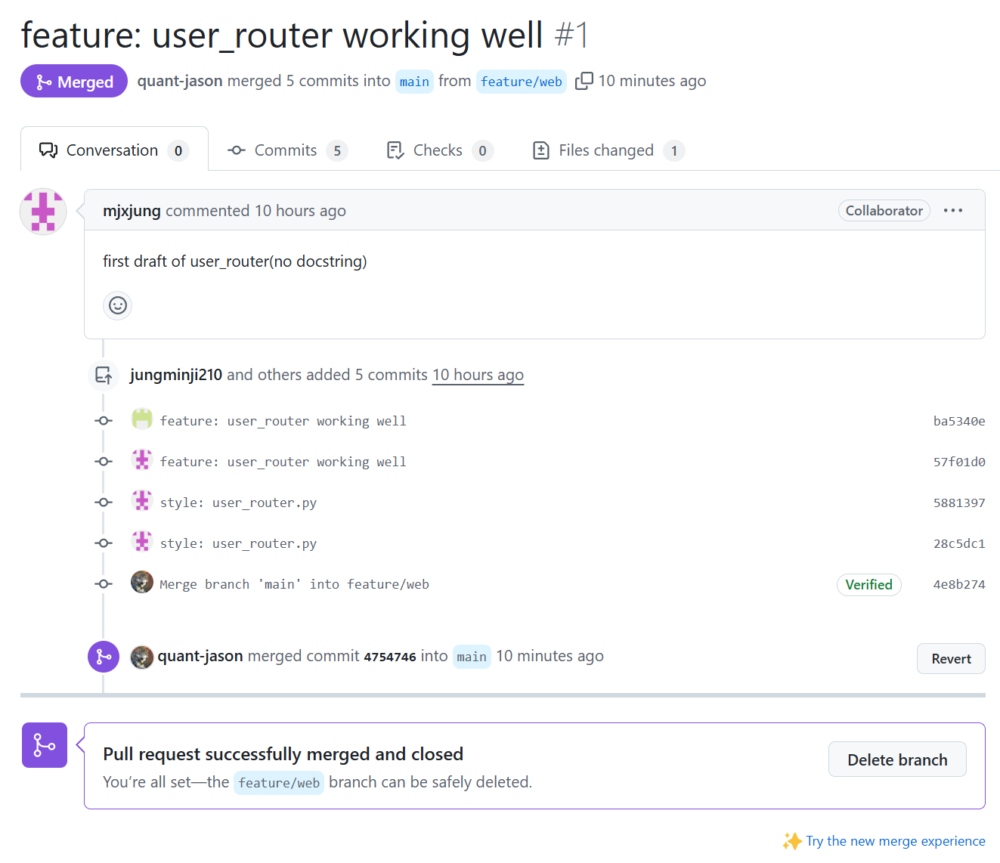

# YBIGTA 26기 2조 팀 프로젝트

## Docker & AWS

**Docker 주소**: [https://hub.docker.com/repository/docker/hyican/ybigta/general](https://hub.docker.com/repository/docker/hyican/ybigta/general)

**Api Endpoint success**

1. /root
   
2. /login
   
3. /register
   
4. /delete
   
5. /update_passoword
   
6. /preprocess
   

**Github Action success**


## **영화 리뷰 데이터 크롤링, 분석 및 전처리**

### 1. 데이터 개요

영화 'The Avengers' 리뷰 데이터를 총 3개의 리뷰 사이트(`Metacritic`, `Rotten Tomatoes`, `IMDB`)에서 크롤링했습니다. 각 데이터에 대해 EDA, 전처리/Feature Engineering(FE)을 수행했고, 사이트별 텍스트 비교를 통한 토픽 분석을 진행했습니다.

#### 1.1 영화 리뷰 사이트

- Metacritic: [https://www.metacritic.com](https://www.metacritic.com)
- Rotten Tomatoes: [https://www.rottentomatoes.com](https://www.rottentomatoes.com)
- IMDB: [https://www.imdb.com](https://www.imdb.com)

#### 1.2 데이터 형식 및 개수

- **Metacritic**: CSV, 843개 데이터
- **Rotten Tomatoes**: CSV, 1219개 데이터
- **IMDB**: CSV, 1595개 데이터

총 3,657개의 데이터를 csv 파일로 수집하였습니다.

## **크롤링 및 전처리 설치 및 실행 방법**

실행방법 - vscode에서 venv가상환경 실행을 기준으로 설명합니다!
(windows vscode 기준이므로 Mac/Linux 환경의 경우 명령어가 다를 수 있습니다)

1. 가상환경(venv) 활성화

- 루트 디렉토리에서 다음 명령어 실행 python -m venv venv
- 의존성 설치 : pip install -r requirements.txt

2. PYTHONPATH 설정
   Vscode powershell 기준 : $env:PYTHONPATH = "설정하고자하는 경로 -> YBIGTA_newbie_team_project파일을 경로로 설정하시면 됩니다"

3. 크롤링 파일 실행

- 현재 파일 위치 변경 : cd "~/review_analysis/crawling"
- 실행 명령어 : python main.py -o ../../database --all

4. 전처리 파일 실행 -현재 파일 위치 변경 : cd "~/review_analysis/preprocessing"

- 실행 명령어 : python main.py --all

---

### **2. 개별 사이트 분석**

### 2.1 Metacritic

#### **EDA 그래프 설명**

- **리뷰 수 변화**  
  아래 그래프는 `Metacritic`의 월별 리뷰 수 변화를 나타냅니다.

  - **특성**:
    2012년에 영화가 개봉함과 함께 리뷰 수가 급격히 증가(300개 이상)하며, 이후 안정화되었습니다.
  - **이상치**:
    후속작이 개봉된 2015, 2018, 2019년에 리뷰 수가 다시 증가했습니다.

  .png>)

- **점수 분포**  
  리뷰 점수는 8~10점(10점 만점)에 집중되어 있으며, 10점 리뷰가 가장 많습니다.

  - **특성**:
    긍정적인 리뷰(8~10점)가 다수를 차지합니다.
  - **이상치**:
    1~4점 리뷰는 매우 적은 편이고 특이하게 0점 리뷰가 그보다 더 많은 걸 확인할 수 있습니다.

  .png>)

#### **전처리 및 FE 결과**

- **결측치 처리**: 결측치를 포함한 행과 날짜 형식이 잘못된 데이터를 제거했습니다.
- **이상치 처리**: 점수(1~10 범위)와 리뷰 길이(Z-score 기준)를 사용해 이상치를 제거했습니다.
- **텍스트 데이터 전처리**: 비정상적으로 짧거나 긴 텍스트 데이터를 제거했습니다.
- **파생 변수 생성**:
  - `month`: 날짜에서 연도-월(`YYYY-MM`) 추출.
  - `day`: 날짜에서 요일 추출.
- **텍스트 벡터화**: TF-IDF를 사용해 주요 단어 500개를 벡터화하여 `tfidf_features` 열에 저장했습니다.

---

### **2.2 Rotten Tomatoes**

#### **EDA 그래프 설명**

- **리뷰 수 변화**  
  Rotten Tomatoes의 리뷰 수는 후속작이 개봉된 시점에 증가하는 패턴을 보입니다.

  - **특성**: 후속작이 개봉된 시점인 (2015, 2018년, 2019년)에 리뷰가 집중되었습니다.
  - **이상치**: 특히 2019년에 큰 상승폭을 보이는 걸 확인할 수 있습니다.

    .png>)

- **점수 분포**  
  점수 분포는 Metacritic과 유사하게 높은 점수(4~5점, 5점 만점)에 집중되어 있습니다.

  - **특성**: 긍정적 리뷰가 다수.
  - **이상치**: 0점 및 1~4점 리뷰의 비중이 매우 낮음.

  .png>)

#### **전처리 및 FE 결과**

- **결측치 처리**: 결측치 포함 행과 날짜 형식 오류 데이터를 제거.
- **이상치 처리**: 점수(1~10 범위)와 리뷰 길이(Z-score 기준)를 사용해 이상치 제거.
- **텍스트 데이터 전처리**: 리뷰 텍스트의 품질을 보장하기 위해 이상치 텍스트 제거.
- **파생 변수 생성**:
  - `month`: 날짜에서 연도-월(`YYYY-MM`) 추출.
  - `day`: 날짜에서 요일 추출.
- **텍스트 벡터화**: TF-IDF를 사용해 주요 단어를 벡터화.

---

### **2.3 IMDB**

#### **EDA 그래프 설명**

- **리뷰 수 변화**  
  IMDB는 비교적 일정한 리뷰 패턴을 보이며, 영화 개봉 시점에 소폭 증가합니다.

  - **특성**: 리뷰 수는 영화 개봉 시점(2012년)에 증가하며, 이후에는 감소하는 패턴을 반복합니다.
  - **이상치**: 후속작 개봉 시점인 2018년(어벤져스3), 2019년(어벤져스4)에 리뷰 수가 소폭 상승하는 이상치를 보입니다.

  .png>)

- **점수 분포**  
  IMDB는 점수가 더 고르게 분포되어 있으며, 긍정적인 리뷰 비중이 높은 편입니다.

  - **특성**: 7~10점 리뷰가 많으며, 전반적으로 긍정적인 리뷰가 다수입니다.
  - **이상치**: 0점 리뷰는 없어서 데이터 입력 오류로 볼 수 있습니다. 2~4점보다 1점의 리뷰가 더 많은 것을 확인할 수 있습니다.

  .png>)

#### **전처리 및 FE 결과**

- **결측치 처리**: 결측치를 포함한 데이터를 제거.
- **이상치 처리**: 점수(1~10 범위)와 리뷰 길이(Z-score 기준)를 사용해 이상치 제거.
- **텍스트 데이터 전처리**: 리뷰 텍스트 이상치 제거.
- **파생 변수 생성**:
  - `month`: 날짜에서 연도-월(`YYYY-MM`) 추출.
  - `day`: 날짜에서 요일 추출.
- **텍스트 벡터화**: TF-IDF를 사용해 주요 단어를 벡터화.

---

## **3. 비교 분석 결과**

### **사이트별 주요 키워드와 토픽 비교**

- **TF-IDF 상위 단어 비교**:
  - Metacritic: `acting`, `cinematography`, `plot`.
  - Rotten Tomatoes: `funny`, `performance`, `visuals`.
  - IMDB: `story`, `character`, `director`.

### **토픽 모델링 결과(LDA)**:

- Metacritic: 영화 제작 기술(촬영, 각본)에 대한 언급 비중이 높음.
- Rotten Tomatoes: 감상적인 요소(유머, 감정)에 대한 리뷰 비중이 큼.
- IMDB: 캐릭터와 감독의 작품 해석에 대한 언급이 두드러짐.

### **사이트별 지수 비교**:

#### **요일별 리뷰 수 비교**:

- 쉬는 날인 금, 토, 일요일에 리뷰 개수가 비교적 더 많은 것을 확인할 수 있다.
- 또한 평일 중에는 월요일이 가장 높은데 주말에 본 영화를 월요일에 후기를 남기는 것으로 분석했다.


#### **평균 점수 비교**:

- 10점 만점인 IMDB, Metacritic을 5점 만점으로 환산해 동일한 기준으로 비교.
- Rotten Tomatoes(RT)가 가장 점수가 후하고 그 다음 Metacritic(Meta), IMDB 순으로 후한 것을 확인할 수 있다.


#### **점수 분포 비교**:

- BOXPLOT을 보면 비교적 IMDB가 점수 분포가 고르다.
- 대체로 분포는 사이트별로 꽤 균등한 편이다.


#### **월별 리뷰 수**:

- 개봉 직후인 2012년에 최고점을 찍고 조금씩 하락했다.
- 2015, 2018, 2019년에 소폭 상승한 것을 볼 수 있다. (후속작 개봉)


#### **후속작 개봉 시점별 리뷰 수 비교**:

- 후속작인 개봉 시점에 사이트별로 리뷰 개수가 대폭 늘어나는 것을 확인할 수 있다.
- 위에서부터 순서대로 어벤져스 2,3,4


---

## **4. 결론**

- Metacritic은 영화의 기술적 요소(촬영, 각본)에 집중된 리뷰가 많음.
- Rotten Tomatoes는 감정적인 요소(유머, 재미)에 대한 리뷰가 많음.
- IMDB는 캐릭터와 감독에 대한 리뷰가 두드러짐.
- 후속작 개봉 시점에 관심 증가로 리뷰 수 증가.
- 비교적 시간이 많은 주말과 주말에 본 영화를 리뷰할 수 있는 월요일에 많은 리뷰.
- 가장 후한 점수를 보이는 건 Rotten Tomatoes 사이트고, 분포대가 가장 고른 사이트는 IMDB.

---

## 프로젝트 소개

이 프로젝트는 YBIGTA 26기 2조 구성원들이 협업하여 **교육세션 팀 프로젝트**를 수행하는 것입니다.  
주요 목표는 **빅데이터 및 활용 방안에 대한 이해**를 높이고, 팀원 간의 협업 능력을 강화하는 데 있습니다.

---

## 팀 및 팀원 소개

YBIGTA 26기 2조는 팀장 윤희찬, 팀원 임재민, 정민지 3인으로 구성되어 있습니다.

### 팀장 윤희찬

| 항목             | 내용                                              |
| ---------------- | ------------------------------------------------- |
| 학과 및 학번     | 응용통계학과 20학번                               |
| 지원 팀          | DA팀 희망                                         |
| 장래희망         | 엔지니어                                          |
| 관심 분야        | 현재로선 YBIGTA                                   |
| 특기/장점        | 일단 해본다                                       |
| MBTI             | INFJ                                              |
| 좋아하는 음악    | old castle by the river in the middle of a forest |
| 여가 시간 활동   | 피아노 / 헬스                                     |
| 하고 싶은 한마디 | 잘 부탁드립니다!                                  |

### 팀원 임재민

| 항목             | 내용                                            |
| ---------------- | ----------------------------------------------- |
| 학과 및 학번     | 경영학과 19학번                                 |
| 지원 팀          | DA팀 희망                                       |
| 장래희망         | 데이터 마케터                                   |
| 관심 분야        | 현재로선 YBIGTA                                 |
| 특기/장점        | 꼼꼼함, 이해될 때까지 반복                      |
| MBTI             | ESFJ                                            |
| 좋아하는 음악    | 밴드음악, LUCY - 아지랑이, 낙화                 |
| 여가 시간 활동   | 게임, 헬스                                      |
| 하고 싶은 한마디 | 좋은 분들과 학회를 통해 계속 성장하고 싶습니다! |

### 팀원 정민지

| 항목             | 내용                                                      |
| ---------------- | --------------------------------------------------------- |
| 학과 및 학번     | 인공지능학과 23학번                                       |
| 지원 팀          | DS팀 희망                                                 |
| 장래 희망        | 개발자, 데이터 과학자                                     |
| 관심 분야        | 코딩, 딥러닝                                              |
| 특기/장점        | 처음에는 부족하더라도 꾸준히 성장하며 점점 더 나아지는 편 |
| MBTI             | ENFP                                                      |
| 좋아하는 음악    | K-Pop, 데이식스 밴드 노래                                 |
| 여가 시간 활동   | OTT 시청, 독서                                            |
| 하고 싶은 한마디 | 학회를 통해 많은 것을 배우고 싶습니다. 잘 부탁드립니다!   |

---

## 설치 및 실행 방법

### 1. Repository 클론

먼저 로컬 환경에 프로젝트를 클론합니다:

```bash
git clone https://github.com/quant-jason/YBIGTA_newbie_team_project.git
```

### 2. 프로젝트 디렉토리로 이동

클론한 디렉토리로 이동합니다:

```bash
cd YBIGTA_newbie_team_project/app
```

### 3. Python 서버 실행

터미널에서 아래 명령어를 실행하여 서버를 실행합니다:

```bash
uvicorn main:app --reload
```

### 4. 웹 애플리케이션 접속

브라우저를 열고 다음 주소로 이동하여 애플리케이션을 확인합니다:

```
http://127.0.0.1:8000
```

---

## 팀원 별 Merge 현황




